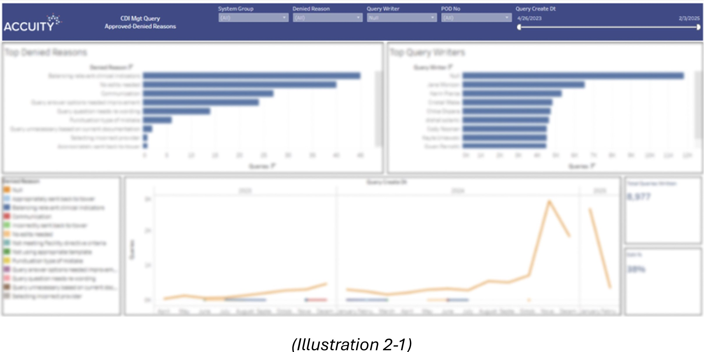
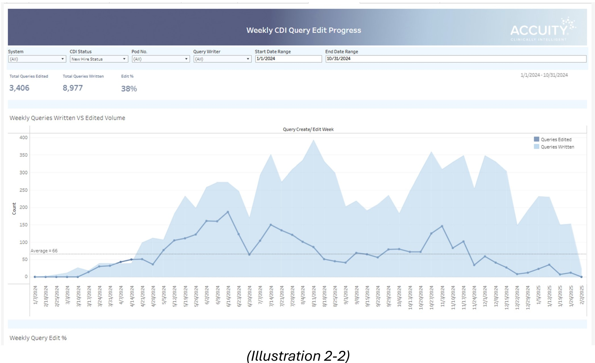

# New Dashboard Layout Designed
#### Background
This section of the depository will walk you through the design of the dashboard layout style for Tableau reports. I noticed that users care about the overall style of the product because it is the first thing they notice about the product and it can form (or is closely related to) the level of impression on the company image and the image of the quality of the product. I believe that appealing product design can also represent the level of sense of our understanding in the application of visualizations.
  
Following the belief described above, I came up with good use cases to elevate the existing dashboard layout style. The existing style was basic. It used a blue background banner for the report title section. The components of the report banner located on the top are the company logo, the report title, and a set of filters to view the same data more dynamically as shown in <i>'Illustration 2-1'</i>. At that time, there were no guidelines for the dashboard layout and each developer followed the rough layout style referring to the layout of the production reports published in Tableau Server. As a result, what I noticed in the reports developed is that the layout of the dashboards is slightly different from report to report and was not consistent. Many of them share the cohesive dashboard layout styles, but there were also a handful number of reports with variations of layout styles. It's the background of how I decided to re-design the existing dashboard layout.
  
#### Design
I re-designed the dashboard layout style in 2 separate times. The first style is developed using Figma, the online UI/UX platform. The layout design is currently used in production Tableau reports. 
  
The second time I designed the dashboard layout was in partnership with my colleague with a background in graphic design. I led the re-design process for determining the various types of report structure, the most suitable visualization type per information, and color code rules. Based on the analysis of the report structure, visualization type, and color code rules, my colleague designed the layout style using graphic design tools. This layout design has not been implemented yet because the transition to the new layout style for 360+ reports is a big change in the back end and also a long-term project. However, we’re consistently looking to develop new ways to improve our system in place.
 

- Existing Dashbaord Layout Style <I>(Illustration 2-1)</i> 
      

- Dashbaord Layout Re-Designed using Figma <i>(Illustration 2-2)</i> 
    

- Dashbaord Layout Re-Designed Further using Graphic Designing Tools</i> 
  [Click here to see the design in PDF](Illustration_2-3.pdf)
  

#### Result
Established 100% design consistency across Tableau reports and upgraded report architect by electing the most suitable visualization type per information.
 

  
