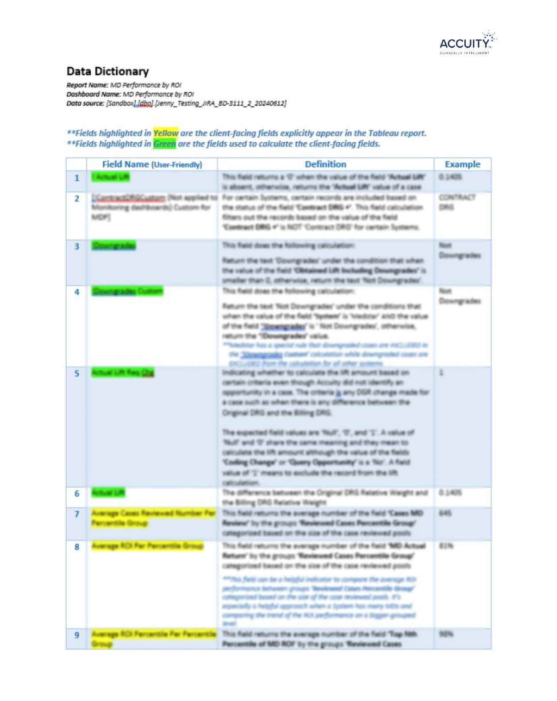
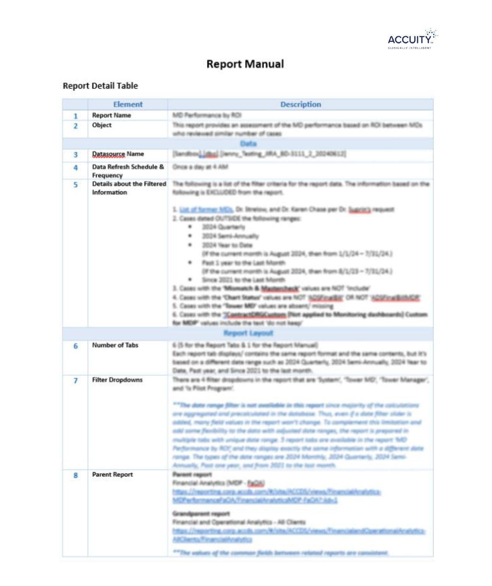
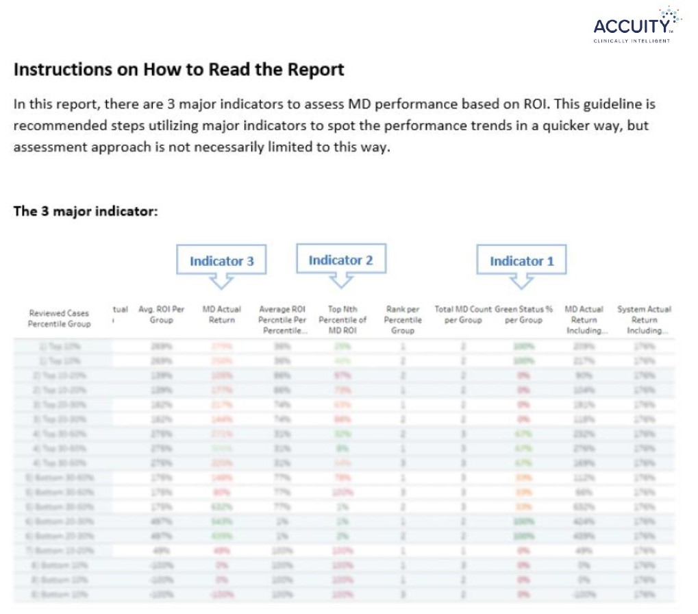
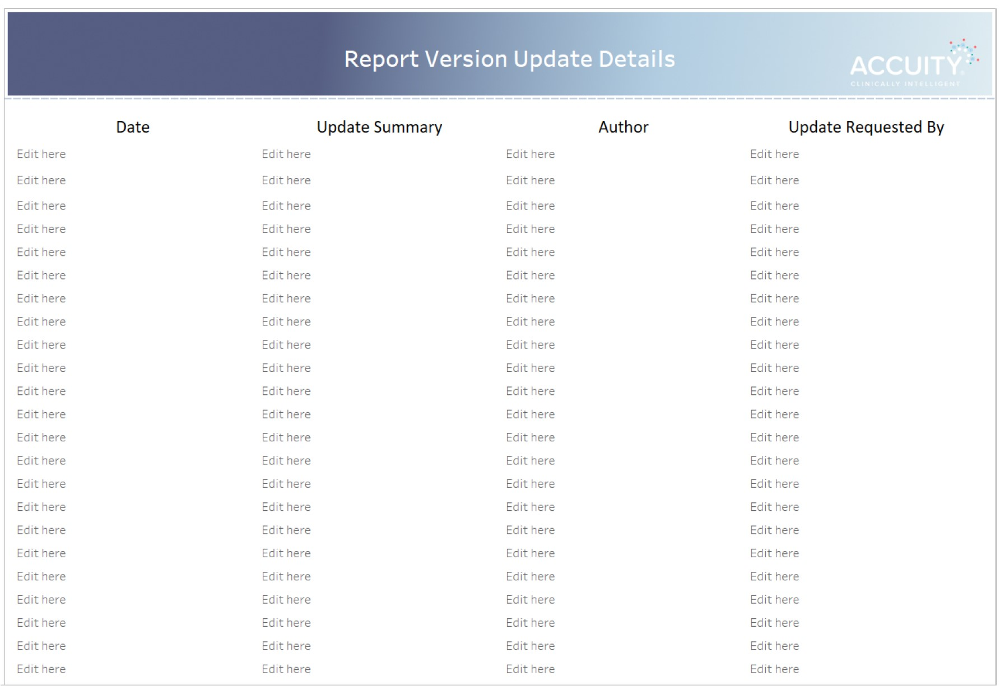

# Establishing the Standard Process for Tech Documentation
#### Objective 
T
  
#### Background/ Problem Defined 
I noticed how powerful documentation is. I felt a strong need for establishing a process to document a project process specifically relating to the technical steps. As I worked on multiple projects and got more experience in the company, I saw that there were types of problems that showed certain patterns or were raised repeatedly. 
 
> ex) 
> - We were repeatedly reported with similar types of inquiries in certain areas by stakeholders
> - We faced the same problems repeatedly
> - We had to go through time-consuming steps whenever debugging certain issues

The common denominator between those issues is that the problem occurs repeatedly and we spend time to address the same type of issues again and again each time it's raised. I thought technical documentation could alleviate the root cause of the problems and prevent it early on.     
 
The most important types of technical documentation needed to be generated per report were a data dictionary, report manual, and edit history. I believe the absence of these types of information documented and the absence of spreading awareness of such information to stakeholders did not establish a standardized understanding of the subject matter internally and externally which ended up resulted in the same issue reported repeatedly. Therefore, I suggested introducing an official documentation step as part of the standard product delivery package.
  

#### Solution Provided 

  
<b><i>1. Data Dictionary</i></b> (Click to see details)

 
End-user들은 자신이 보고있는 데이터에대한 이해도가 생각보다 낮았는데, 그들에게 official data dictionary가 제공되지않아 그들이 우리에게 데이터에대해 자주 문의를 했었다. 그리고 또 내가 알게된 사실이 developers사이에서도 비슷한 테이터가 많을 경우에 이해하고있는 데이터의 의미가 조금씩 다르다는것도 알게되었다.
그리하여 각 리포트마다 포함된 데이터에관한 Data dictionary를 end-user에게 제공하였다.
 
   

 

  
<b><i>2. Report Manual (or User Manual)</i></b> (Click to see details)

 
This is a testing sentence.
 
 

 

  
<b><i>3. Edit History</i></b> (Click to see details)

 
This is a testing sentence.

 

#### Result 
Strengthened product package provided additional informative resources to clients and customer inquiries about products reduced by 20%, Also, it clarified the logic of products for internal team members by 100% and reduced the internal inspection time for debugging by 17%.
++Debugging 할떄 엄청도움됨
