# Example Excel Solutions
Provide customized and automated Excel solutions for non-tech departments in regard to steps that require frequent user updates by converting manual processes into an automated process to optimize workflow and allow users to focus more on decision-making. 
   

# 1. Access Information Tracker

  
<b><i>1-1. Problem Defined</i></b>  (Click to see details)
 
Stakeholders were looking for a way to manage and track the hospital access information per employee for 100+ CDIs. VP of CDI oversight more than 100 CDIs at that time and each CDI had access to certain hospital systems and the access changed on a weekly basis. She struggled to manage and track the weekly changes in the access information for 100+ CDIs so
I was invited to develop a process for handling it in an efficient way. Since the frequency of the change in access is weekly, it was difficult to automate the entire flow back-end because such information is determined by 8 CDI managers and they had to update the information on their end. When the workflow requires a frequent user update, Excel becomes very powerful for individuals without a technical background. So I decided to build an automated data tracking model using Excel. 

  
 

  
<b><i>1-2. Solution Provided</i></b>  (Click to see details)
 
I built data management functions in Excel to track/ manage employee access to certain data for 100+ employees and their access to data changes weekly. The automated Excel model centralizes locations for user input per entity. Users manage and update the information in one place. 
  

There are 5 spreadsheets (tabs) in the model as shown in <i>'Illustration 1-2-1'</i>. The first 3 tabs require manual user input while the remaining 2 tabs in blue are prepared automatically based on the manual user input in tab '(Input) Access'. The titles of 5 tabs are (Dropdown) CDI*, (Dropdown) System*, (Input) Access*, System Tracker*, and CDI Tracker*.   

 
  
> - **1. (Dropdown) CDI** 
> takes manual user inputs for employees’ (CDIs) information. Then the inputs become a source of dropdown in the tab ‘(Input) Access’. For example, users need to enter data for Columns B (Last Name), C (Preferred/ First Name), and D (Employment Status) and this information is used as dropdown options in the tab ‘(Input) Access’. In this way, users don’t need to type in employee information in other tabs once such information is available in the tab ‘(Input) Access’ and it significantly removed the typo errors in employee information. The column names highlighted in green indicate that these columns require manual user inputs and the information that needs user input is highlighted in green in the tab ‘(Dropdown) CDI’. 
>
>   In addition, it centralizes the path for data entry for employees’ (CDIs) information as users update/ manage the employee information in one designated place ‘(Dropdown) CDI’. Users update all CDI-related information in the tab only.
> 
>   When a value for Column ‘Employment Status’ is set to ‘Non-active”, the corresponding employee's (CDI’s) information is eliminated as a source of the dropdown options in other tabs.
>  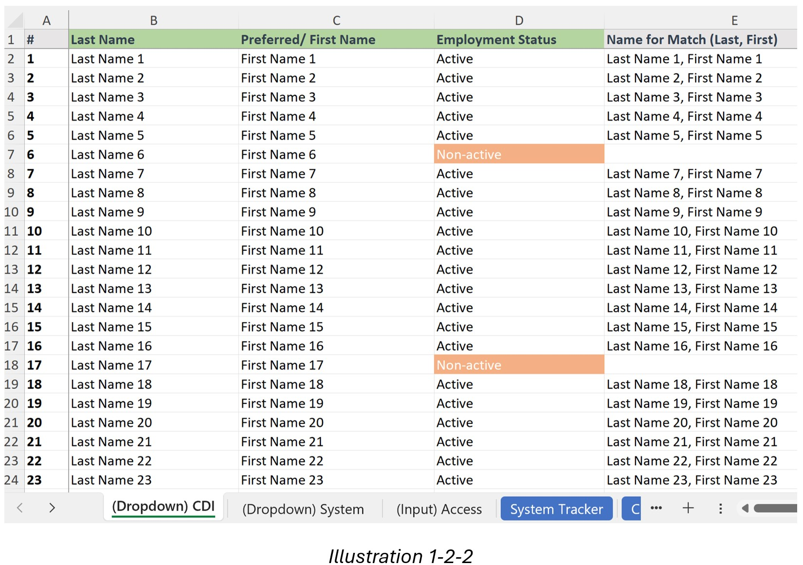  
> 
> - **2. (Dropdown) System** 
> does a similar function as the tab '(Dropdown) CDI'. It takes manual user inputs for the hospital information instead of the employee information and the information available here becomes the source of the dropdown options in the tab '(Input) CDI'. Thus, users no need to type the hospital information again in other tabs once the hospital information is inserted in '(Dropdown) System.'
> 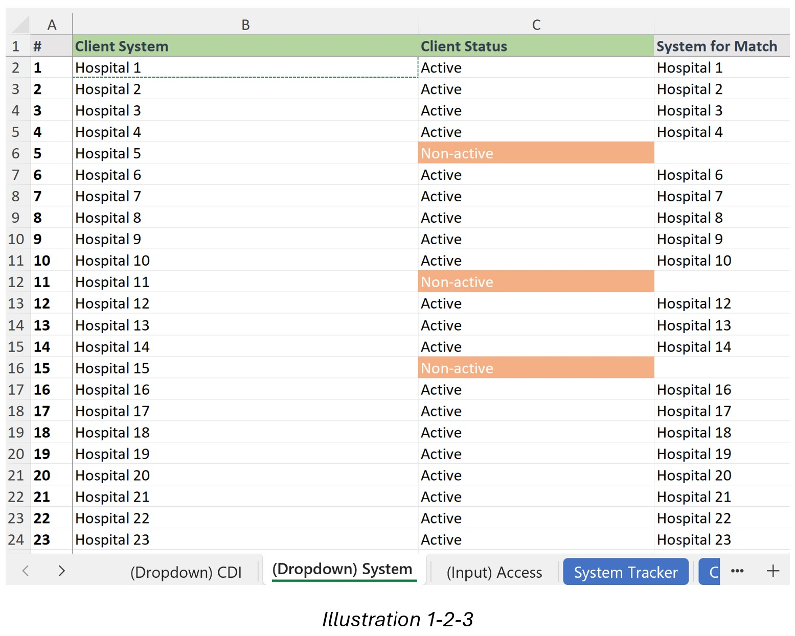  
> 
> - **3. (Input) Access** 
> takes user inputs using the dropdown options selected for the hospital and the employee information. Users complete a list of employees who have access per hospital.  
> 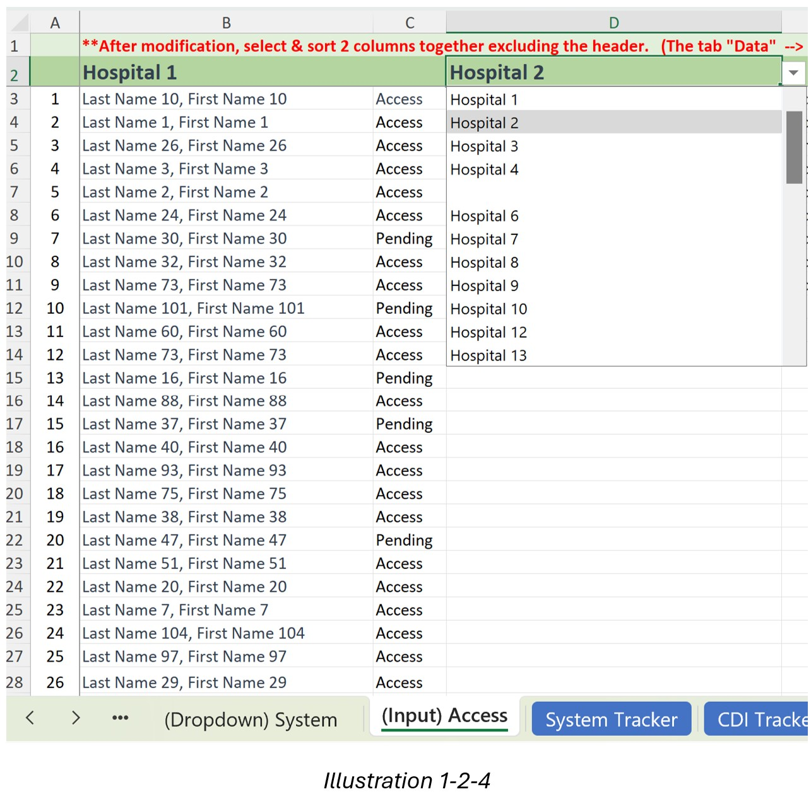 
> 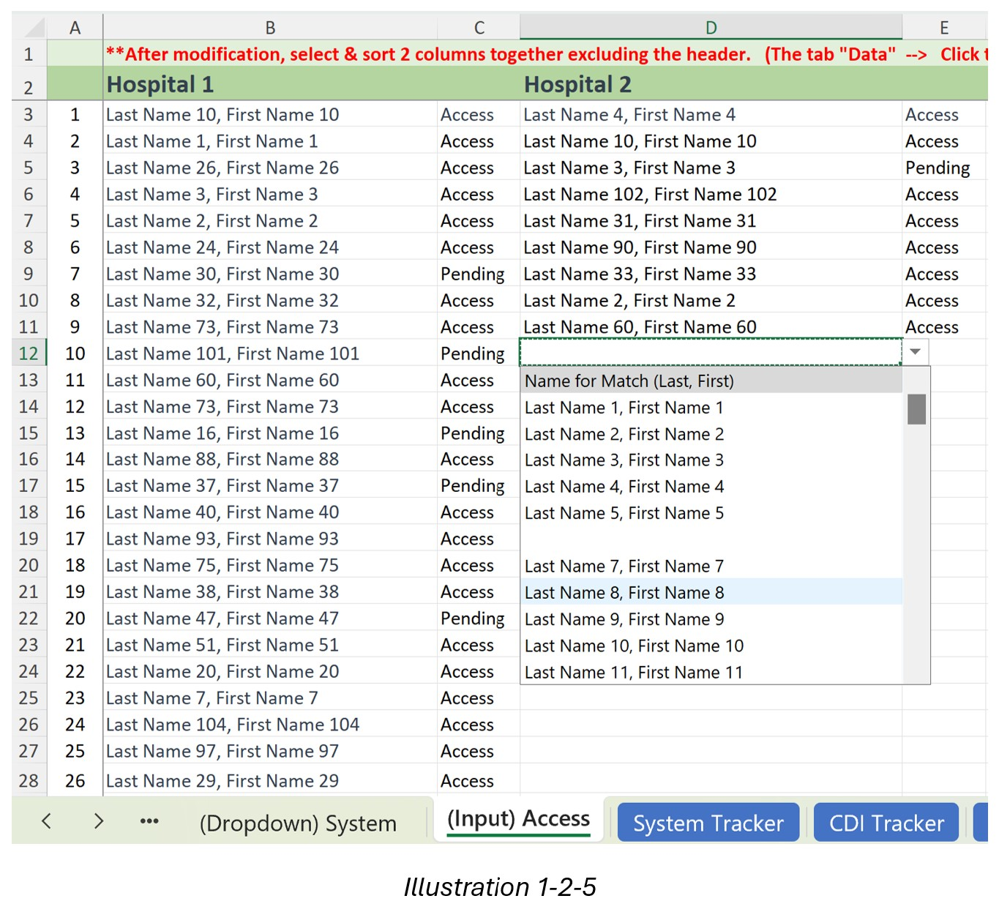  
> 
> - **4. System Tracker** 
> tab is highlighted in blue, indicating that this tab is automatically prepared based on the information provided in the tab '(Input) Access'. It re-organizes the information in '(Input) Access' and displays a list of employees who have system access per hospital. 
> 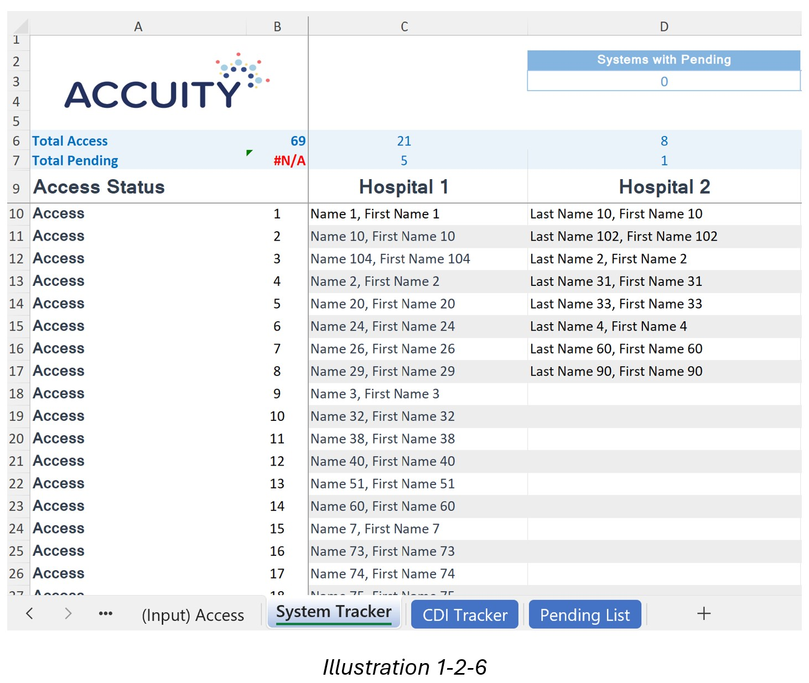 
> 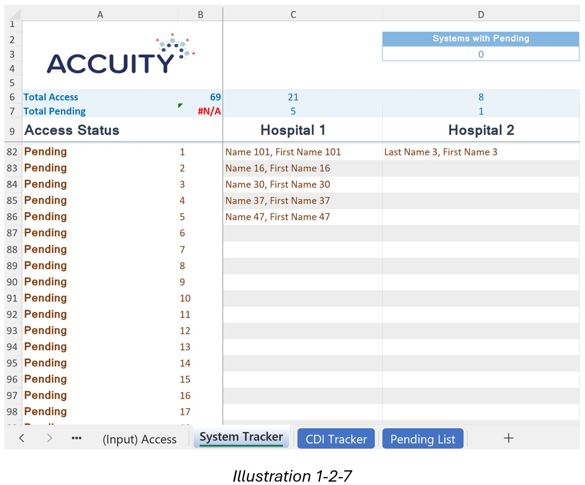  
>
> - **5. CDI Tracker** 
> tab is highlighted in blue, indicating that this tab is automatically prepared based on the information provided in the tab '(Input) Access'. It re-organizes the information in '(Input) Access' and displays a list of hospitals per employee that the employee has access to.
>  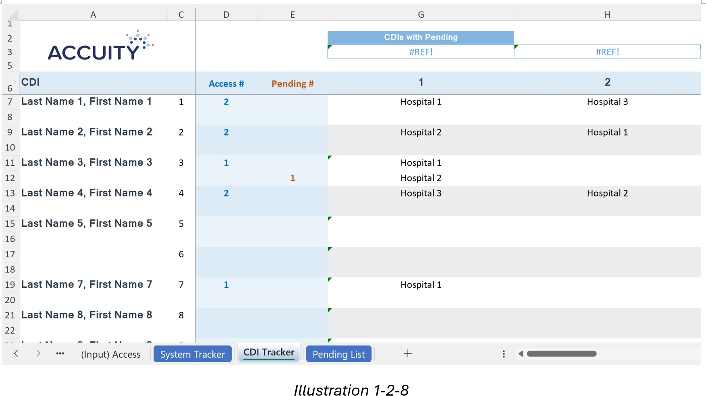 

 

  
<b><i>1-3. Improvement & Result</i></b>  (Click to see details)
 
The model established an automatic process to track such information, shortened the tracking flow by 200%, and reduced typo errors by 90%.

 
 

# 2. Formatting 
### 2-1. Rearranging Data Layout

  
<b><i>2-1-1. Problem Defined</i></b>  (Click to see details)
 
The data copied from a PDF file from a client was pasted out of order when pasted in Excel. All data was pasted in Column A as shown in <i>'Illustration 2-1-1'</i> below. Stakeholders conduct internal analysis using this number in Excel, but the data pasted out of order made it difficult to work with.  

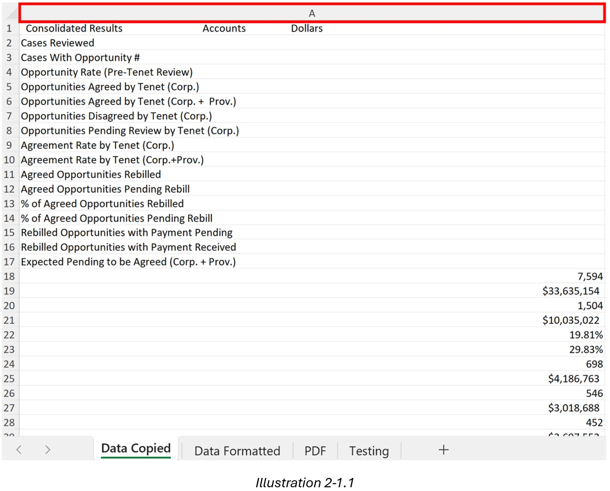

  
 

  
<b><i>2-1-2. Solution Provided</i></b>  (Click to see details)
 
I created an automated formatting tool using functions in Excel that reorganized unstructured information pasted into desired formats in a new spreadsheet. I created 2 spreadsheets in the Excel model called ‘Data Copied’ and ‘Data Formatted’ as shown in <i>'Illustration 2-1-2'</i>. ‘Data Copied’ requires the user to input data. When users paste the PDF data in ‘Data Copied’, the data is automatically re-formatted in the spreadsheet ‘Data Formatted’ as shown in <i>'Illustration 2-1-3'</i>. 

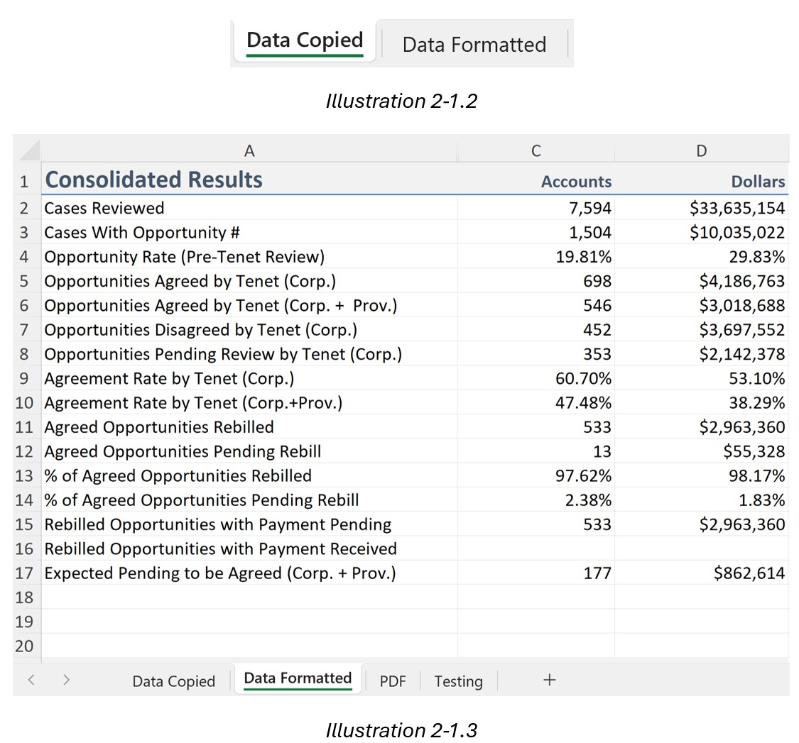

  
 

  
<b><i>2-1-3. Improvement & Result</i></b>  (Click to see details)
 
The model removed typo errors by 75% and automated formatting removed manually modifying the process completely.
  
   

### 2-2. Adjusting Row Height

  
<b><i>2-2-1. Problem Defined</i></b>  (Click to see details)
 
The data downloaded from the tool internally developed by the firm and in Excel format had very tall row heights for Column N, P, and R (highlighted in yellow) with long texts as shown in <i>'Illustration 2-2-1'</i>. It made the height of the entire file very long to scroll down and stakeholders were unable to manage the data in the file. They’re looking to view the data in a more manageable way preferably in the single spacing format for the columns.  

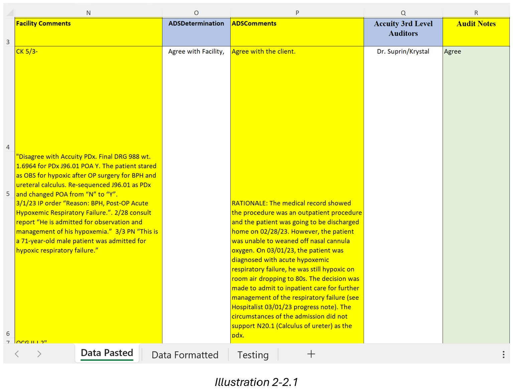

  
 

  
<b><i>2-2-2. Solution Provided</i></b>  (Click to see details)
 
I created an automated formatting tool using functions in Excel that reorganized unstructured information pasted into desired formats in a new spreadsheet. I created 2 spreadsheets in the Excel model called ‘Data Pasted’ and ‘Data Formatted’ as shown in <i>'Illustration 2-2-2'</i>. ‘Data Pasted’ requires a user input of data. When users paste the downloaded Excel data in ‘Data Pasted’, the data is automatically re-formatted in the spreadsheet ‘Data Formatted’ that each row height for Column N, P, and R is now adjusted to a single spacing-like height as depicted in <i>'Illustration 2-2-3'</i>.  

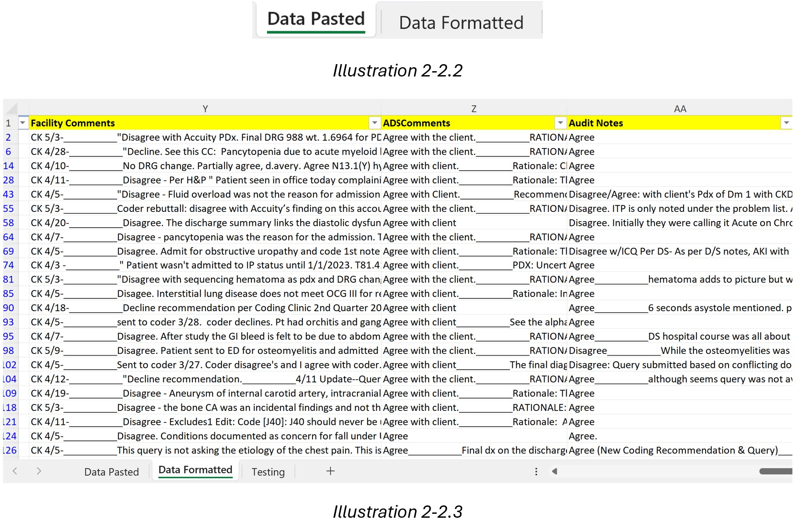

  
 

  
<b><i>2-2-3. Improvement & Result</i></b>  (Click to see details)
 
The model transformed the data into a more manageable format and eliminated the time for data preparation for stakeholders.

  
   
